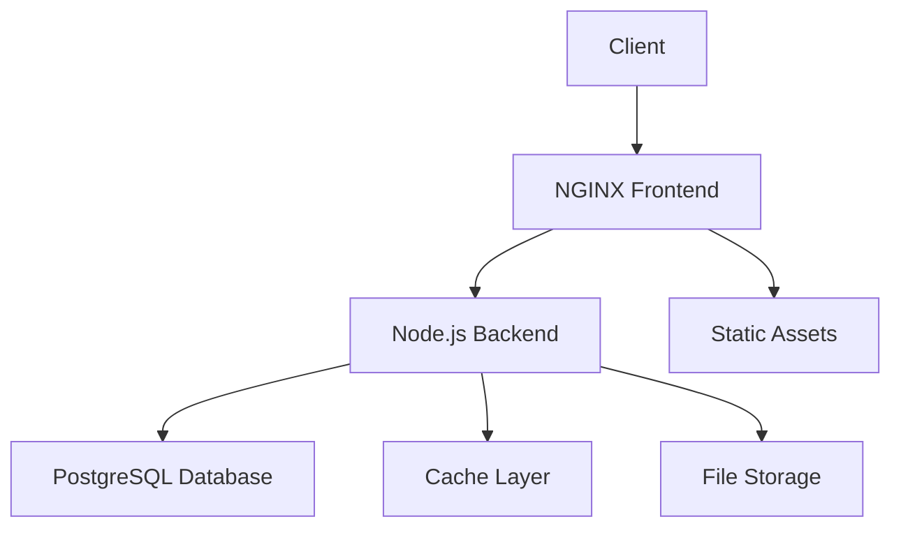

# 🛍️ Online Store - Modern E-commerce Platform

<div align="center">


</div>

<p align="center">
  
</p>

A modern, containerized e-commerce application built with a microservices architecture. This project showcases best practices in containerization, security, and scalability while providing a robust foundation for e-commerce operations.

## 📑 Table of Contents

- [Features](#-features)
- [Architecture](#-architecture)
- [Directory Structure](#-directory-structure)
- [Prerequisites](#-prerequisites)
- [Installation](#-installation)
- [Configuration](#-configuration)
- [Development](#-development)
- [Security](#-security)
- [Monitoring](#-monitoring)
- [Contributing](#-contributing)
- [License](#-license)

## 🌟 Features

### Core Features
- **Product Management**
  - Catalog browsing and search
  - Category-based navigation
  - Product details and variations
  - Stock management

- **Shopping Experience**
  - Intuitive cart management
  - Secure checkout process
  - Order tracking
  - Wishlist functionality

- **User Management**
  - Secure authentication
  - Profile management
  - Order history
  - Address management

### Technical Features
- **Containerization**
  - Multi-stage Docker builds
  - Docker Compose orchestration
  - Volume management
  - Network isolation

- **Security**
  - Non-root container execution
  - Environment variable protection
  - CORS configuration
  - Rate limiting

- **Monitoring**
  - Health check endpoints
  - Resource monitoring
  - Log management
  - Performance metrics

## 🏗️ Architecture

### System Components



### Service Details

1. **Frontend Service (NGINX)**
   - Static file serving
   - Gzip compression
   - Cache optimization
   - Load balancing ready

2. **Backend Service (Node.js)**
   - RESTful API
   - Business logic
   - Authentication
   - Data validation

3. **Database Service (PostgreSQL)**
   - Data persistence
   - ACID compliance
   - Backup management
   - Data integrity

## 📁 Directory Structure

```
online-store/
├── .github/                    # GitHub Actions workflows
│   └── workflows/
│       └── ci.yml
├── frontend/                   # Frontend application
│   ├── src/                   # Source files
│   │   ├── assets/           # Static assets
│   │   ├── components/       # UI components
│   │   ├── styles/          # CSS styles
│   │   ├── app.js          # Main application
│   │   └── index.html      # Entry point
│   ├── tests/               # Frontend tests
│   ├── .dockerignore        # Docker ignore rules
│   ├── Dockerfile          # Frontend container
│   ├── nginx.conf          # NGINX configuration
│   └── package.json        # Dependencies
├── backend/                    # Backend application
│   ├── src/                   # Source files
│   │   ├── controllers/      # Request handlers
│   │   ├── models/          # Data models
│   │   ├── routes/          # API routes
│   │   ├── middleware/      # Custom middleware
│   │   ├── utils/          # Utility functions
│   │   └── server.js       # Entry point
│   ├── tests/               # Backend tests
│   ├── .dockerignore        # Docker ignore rules
│   ├── Dockerfile          # Backend container
│   └── package.json        # Dependencies
├── database/                   # Database configurations
│   ├── migrations/           # DB migrations
│   ├── seeds/               # Seed data
│   └── schema.sql           # DB schema
├── scripts/                    # Utility scripts
│   ├── backup.sh            # Backup script
│   └── deploy.sh            # Deployment script
├── docs/                       # Documentation
│   ├── api/                 # API documentation
│   ├── deployment/          # Deployment guides
│   └── development/         # Development guides
├── .env.example               # Environment template
├── .gitignore                 # Git ignore rules
├── docker-compose.yml         # Container orchestration
├── docker-compose.override.yml # Local overrides
└── README.md                  # Project documentation
```

## 🚀 Getting Started

### Prerequisites

- Docker Engine 20.10+
- Docker Compose 2.0+
- Git
- Node.js 20+ (for local development)

### Quick Start

1. **Clone the repository**
   ```bash
   git clone https://github.com/MalikShoaibAhmadKhan/ONLINE-STORE.git
   cd ONLINE-STORE
   ```

2. **Set up environment variables**
   ```bash
   cp .env.example .env
   # Edit .env with your configurations
   ```

3. **Start the application**
   ```bash
   docker-compose up -d
   ```

4. **Access the application**
   - Frontend: http://localhost:80
   - Backend API: http://localhost:3000
   - API Documentation: http://localhost:3000/api-docs

## ⚙️ Configuration

### Environment Variables

```env
# Node Environment
NODE_ENV=production

# Database Configuration
DB_HOST=db
DB_USER=postgres
DB_PASSWORD=your_strong_password_here
DB_NAME=onlinestore
DB_PORT=5432

# Backend Configuration
BACKEND_PORT=3000
BACKEND_HOST=0.0.0.0

# Frontend Configuration
FRONTEND_PORT=80

# Security
JWT_SECRET=your_jwt_secret_here
JWT_EXPIRATION=24h
```

### Docker Configuration

```yaml
# Resource Limits
resources:
  limits:
    cpus: '1.00'
    memory: 1G
  reservations:
    cpus: '0.25'
    memory: 256M
```

## 💻 Development

### Local Development

```bash
# Frontend
cd frontend
npm install
npm start

# Backend
cd backend
npm install
npm run dev
```

### Docker Commands

```bash
# Build services
docker-compose build

# Start services
docker-compose up -d

# View logs
docker-compose logs -f

# Stop services
docker-compose down

# Remove volumes
docker-compose down -v
```

## 🔒 Security Features

- Non-root container execution
- Environment variable protection
- CORS configuration
- Rate limiting
- SQL injection protection
- XSS prevention
- CSRF protection
- Security headers

## 📊 Monitoring

### Health Checks

- Frontend: `http://localhost:80/health`
- Backend: `http://localhost:3000/health`
- Database: Internal PostgreSQL health check

### Logging

- JSON format logs
- Log rotation
- Size-based log management
- Separate logs per service

### Resource Monitoring

- CPU usage tracking
- Memory consumption
- Disk space monitoring
- Network usage

## 🤝 Contributing

1. Fork the repository
2. Create your feature branch
   ```bash
   git checkout -b feature/amazing-feature
   ```
3. Commit your changes
   ```bash
   git commit -m 'Add some amazing feature'
   ```
4. Push to the branch
   ```bash
   git push origin feature/amazing-feature
   ```
5. Open a Pull Request

## 📝 License

This project is licensed under the MIT License - see the [LICENSE](LICENSE) file for details.

---

<div align="center">

Made with ❤️ by [Malik Shoaib Ahmad Khan](https://github.com/MalikShoaibAhmadKhan)

</div> 